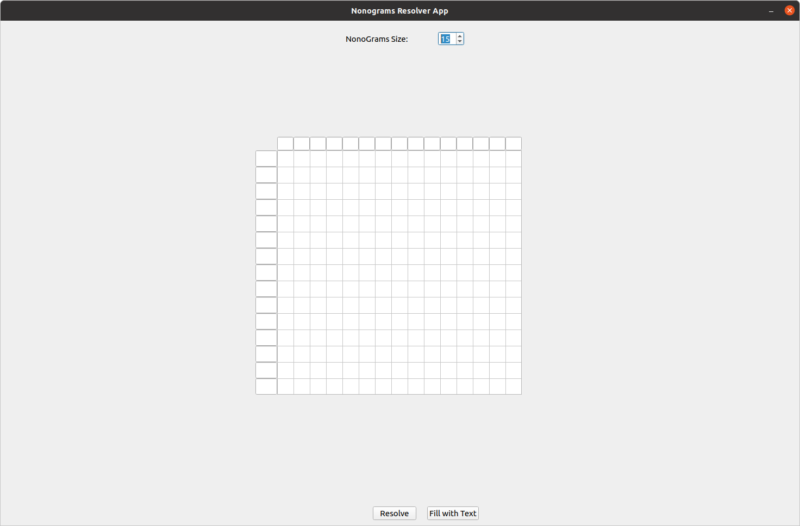

# NonoGrams-Resolver
[](https://nodesource.com/products/nsolid)

[](https://travis-ci.org/joemccann/dillinger)

ROS package with the ability to solve nonograms.
This package consists of a graphical interface made in Python with PyQt5 and 
the part that solves the algorithms in C++. To communicate both systems, 
ROS Noetic has been used. To launch the graphical interface, perform the following command:
```
roscore
python3 mainGUI.py

or 

roscore & python3 mainGUI.py
Do not forget to close everything: pkill -9 rosmaster (& create a thread)
```

Both widgets have their doctests and all their documentation created.
- Documentation: ``` pydoc name_script (without .py)```
- Test: ``` python3 name_script.py -v```

## Graphical Interface (GUI)
The graphical interface is composed of the **mainGUI.py** and
two customs widgets: **nonogramsLineEdit.py** and **nonogramsTableView.py**

<p align="center">

</p>

There are two ways to enter the data:
- By hand
- Pressing the button 'Fill With Text'. The text entered should be as follows: 

```
5
1
5
1
5
1 1
5
1 1
1 1
1 1
1 2
```

## Algorithm (TODO Documentation)

The tests and most of the logic that will be used to solve the algorithms have been created.